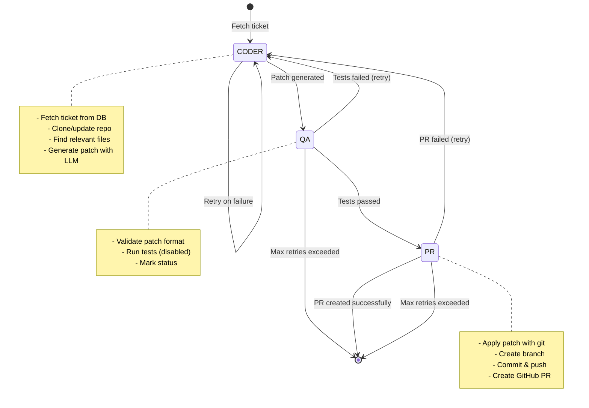

# Developer Agents Workflow - Architecture

**Autonomous Coding Agent System**
Version: 1.2 | Last Updated: 2026-06-22

---

## 🎯 System Overview

An autonomous coding agent that:
1. Fetches coding tasks from a database
2. Clones/updates git repositories
3. Generates code patches using LLMs
4. Creates GitHub pull requests automatically
5. Handles errors with retry logic

**Goal:** Process 2000+ tickets per month at <$5/month cost (~$0.0066 per ticket)

---

## 🏗️ Architecture Diagram

```
┌─────────────────────────────────────────────────────────────────┐
│                         User / System                            │
│                              │                                   │
│                    Triggers: python main.py                      │
└──────────────────────────────┬──────────────────────────────────┘
                               │
                               ▼
┌─────────────────────────────────────────────────────────────────┐
│                      LangGraph Workflow                          │
│                         (main.py)                                │
│                                                                  │
│  ┌──────────┐      ┌──────────┐      ┌──────────┐             │
│  │  CODER   │ ───> │    QA    │ ───> │    PR    │             │
│  │  AGENT   │ <─── │  AGENT   │ <─── │  AGENT   │             │
│  └──────────┘      └──────────┘      └──────────┘             │
│       │                  │                  │                   │
└───────┼──────────────────┼──────────────────┼──────────────────┘
        │                  │                  │
        │                  │                  │
┌───────▼──────────────────▼──────────────────▼──────────────────┐
│                    Helper Modules                               │
│                                                                  │
│  ┌─────────────┐  ┌─────────────┐  ┌─────────────┐            │
│  │   LLM       │  │  Workspace  │  │  GitHub PR  │            │
│  │ (llm.py)    │  │(workspace.py)│  │(github_pr.py)│           │
│  └─────────────┘  └─────────────┘  └─────────────┘            │
│                                                                  │
│  ┌─────────────┐  ┌─────────────┐  ┌─────────────┐            │
│  │  Supabase   │  │  Context    │  │   Tickets   │            │
│  │(supabase.py)│  │(context.py) │  │ (tickets.py)│            │
│  └─────────────┘  └─────────────┘  └─────────────┘            │
└──────────────────────────────────────────────────────────────┘
        │                  │                  │
        │                  │                  │
┌───────▼──────────────────▼──────────────────▼──────────────────┐
│                   External Services                              │
│                                                                  │
│  ┌─────────────┐  ┌─────────────┐  ┌─────────────┐            │
│  │   Supabase  │  │     LLM     │  │   GitHub    │            │
│  │  PostgreSQL │  │  (Ollama/   │  │   API v3    │            │
│  │  Database   │  │ OpenRouter) │  │             │            │
│  └─────────────┘  └─────────────┘  └─────────────┘            │
└──────────────────────────────────────────────────────────────┘
```

---

## 🔄 Workflow State Machine



---

## 📦 Component Details

### **1. Main Orchestrator (`main.py`)**

**Purpose:** LangGraph workflow coordinator

**Key Functions:**
- `coder_agent(state)` - Generates code patches
- `qa_agent(state)` - Validates patches (currently disabled)
- `pr_agent(state)` - Creates pull requests
- `route_after_qa(state)` - Routing logic
- `route_after_pr(state)` - Routing logic

**State Management:**
```python
{
    "ticket_id": "SEO-TRENDS-001",
    "spec": "Full ticket specification...",
    "status": "coding|testing|pr_ready|completed|failed",
    "current_patch": "{\"src/pages/LandingPage.tsx\": \"<<<< SEARCH...\"}",  # JSON dict
    "file_paths": ["src/pages/LandingPage.tsx"],
    "error_logs": ["Block 2/3: SEARCH text not found..."],
    "qa_retry_count": 0,
    "repo_url": "https://github.com/...",
    "pr_url": "https://github.com/.../pull/123"
}
```

---

### **2. LLM Integration (`helpers/llm.py`)**

**Purpose:** Generate code patches using configured LLM

**Architecture:**
- **Configurable Provider:** Ollama (local) or OpenRouter (API)
- **XML-Structured Prompts:** Clear sections for context, spec, rules
- **Adaptive Strategy:** Single-file fast path, multi-file sequential

**Key Functions:**

```python
def get_llm_client() -> OpenAI:
    """Returns configured client (Ollama or OpenRouter)"""
    
def generate_patch(spec, file_contexts, error_logs, repo_path) -> dict:
    """Returns {file_path: sr_blocks} dict. Single-file = 1-item dict."""
    
def _generate_single_file_patch(...) -> str:
    """Generates S/R blocks for one file with XML-structured prompt"""

def _generate_new_files(client, project_context, spec, existing_patched) -> dict:
    """For new-feature tickets: asks LLM for brand-new files to create.
    Only called when spec contains signals like 'create', 'new component' etc."""
    
def llm_call(prompt, system_prompt, max_tokens, temperature) -> str:
    """Generic LLM call used for file selection (Stage 2)"""
```

**New File Creation Convention:**
When a feature requires a brand-new file, `_generate_new_files` produces an
empty-SEARCH block — the applier creates the file from scratch:
```
<<<< SEARCH
====
[full new file content]
>>>> REPLACE
```
```

**Prompt Structure:**
```xml
<project_context>...</project_context>
<specification>...</specification>
<current_code file="path" language="tsx">...</current_code>
<previous_errors>...</previous_errors>
<rules>...</rules>
<example_valid_diff>...</example_valid_diff>
```

**Configuration:**
```bash
LLM_PROVIDER=ollama  # or "openrouter"
LLM_MODEL=deepseek-coder-v2:16b  # or "deepseek/deepseek-v4-flash"
```

---

### **3. Workspace Management (`helpers/workspace.py`)**

**Purpose:** Git operations and intelligent file selection

**Key Features:**

**A) Repository Management:**
- Shared workspace pattern: `/tmp/agent-workspaces/{md5_hash}/`
- One clone per repo (reused across tickets)
- Git operations: clone, pull, checkout, branch creation

**B) Smart File Selection — Repo Map Approach (Aider-style):**

```
┌──────────────────────────────────────────────────┐
│           Smart File Selection Flow              │
└──────────────────────────────────────────────────┘
                      │
                      ▼
          ┌───────────────────────┐
          │  Check for "ONLY"     │
          │  keyword → return     │
          │  explicit file only   │
          └───────────┬───────────┘
                      │ (no ONLY)
                      ▼
          ┌───────────────────────┐
          │  git ls-files +       │
          │  COPILOT ignore list  │
          │  → all source files   │
          └───────────┬───────────┘
                      │
                      ▼
          ┌───────────────────────┐
          │  Universal Ctags      │
          │  builds REPO MAP      │
          │  (file → symbols)     │
          │  If >80k chars: trim  │
          └───────────┬───────────┘
                      │
                      ▼
          ┌───────────────────────┐
          │  Stage 2 LLM reads    │
          │  repo map, matches    │
          │  symbols to spec      │
          │  → returns top 5      │
          └───────────┬───────────┘
                      │
                      ▼
               ┌─────────────┐
               │ Return max 5│
               │ files        │
               └─────────────┘
```

**Why Repo Map over Keyword Scoring:**
- Keyword scoring on file paths misses short identifiers ("pip" → 3 chars)
- Repo map shows actual symbol names: LLM matches "pip" → `TimerPiP`, 
  "picture-in-picture" → `usePictureInPicture` directly
- `git ls-files` respects `.gitignore` automatically — no hardcoded exclusions
- COPILOT_INSTRUCTIONS.md "Files to IGNORE" section parsed for project-specific exclusions

**Key Functions:**
```python
def get_all_source_files(repo_path) -> list:
    """git ls-files + source extension filter + COPILOT ignore patterns"""

def build_repo_map(repo_path, files) -> str:
    """Run Universal Ctags → compact 'file → symbol1, symbol2' map string"""

def find_relevant_files(repo_path, spec, max_files) -> list:
    """Keyword scorer — fallback for very large repos (>80k char map)"""

def find_relevant_files_smart(repo_path, spec, max_files=5) -> list:
    """Full pipeline: ONLY-check → repo map → Stage 2 LLM"""

def _get_ignore_patterns(repo_path) -> list:
    """Parse COPILOT_INSTRUCTIONS.md 'Files to IGNORE' section"""
```

---

### **4. GitHub Integration (`helpers/github_pr.py`)**

**Purpose:** Apply Search/Replace blocks per-file and create PRs

**Apply Pipeline:**
```
Patch dict {file: sr_blocks}
    │
    ▼
┌─────────────────────┐
│ For each file:      │
│ parse S/R blocks    │
│ with regex          │
└──────┬──────────────┘
       │
       ▼
┌─────────────────────┐
│ Empty SEARCH?       │
│ → Create new file   │
│ Non-empty SEARCH?   │
│ → str.replace()     │
└──────┬──────────────┘
       │
       ▼
┌─────────────────────┐
│ On failure:         │
│ git checkout -- .   │
│ (restore workspace) │
│ git checkout main   │
└──────┬──────────────┘
       │
       ▼
┌─────────────────────┐
│ git add -A          │
│ git commit & push   │
└──────┬──────────────┘
       │
       ▼
┌─────────────────────┐
│ Create PR via       │
│ GitHub API          │
└──────┬──────────────┘
       │
       ▼
   Success!
```

**Key Functions:**
```python
def apply_search_replace_blocks(file_path, llm_output) -> tuple[bool, str]:
    """Parse and apply S/R blocks. Empty SEARCH = create new file."""

def apply_patch_and_create_pr(repo_path, patch: dict, ticket_id, spec) -> tuple[str, str]:
    """Iterates patch dict, applies per-file, commits, pushes, creates PR.
    Returns (pr_url, error_message)"""
```

**Patch Dict Format (JSON-serialised for DB):**
```python
# generate_patch() returns:
{
    "src/components/TimerPiP.jsx": "<<<< SEARCH\n...\n>>>> REPLACE",
    "src/components/TimerPiP.css": "<<<< SEARCH\n...\n>>>> REPLACE",
    # New files use empty SEARCH:
    "src/components/TypingGame.jsx": "<<<< SEARCH\n====\n[full content]\n>>>> REPLACE"
}
# Stored in DB as json.dumps(patch), loaded with json.loads(patch_raw)
```

**Workspace Cleanup:**
Every failure path runs `git checkout -- .` before switching branches.
This prevents dirty workspace state from poisoning subsequent retries.
       ▼
┌─────────────────────┐
│ For each block:     │
│ exact str.replace() │
│ in target file      │
└──────┬──────────────┘
       │
       ▼
┌─────────────────────┐
│ Create branch       │
│ agent/{id}-{time}   │
└──────┬──────────────┘
       │
       ▼
┌─────────────────────┐
│ git add -A          │
│ git commit & push   │
└──────┬──────────────┘
       │
       ▼
┌─────────────────────┐
│ Create PR via       │
│ GitHub API          │
└──────┬──────────────┘
       │
       ▼
   Success!
```

**Key Functions:**
```python
def apply_search_replace_blocks(file_path, llm_output) -> tuple[bool, str]:
    """Parse and apply S/R blocks. Returns (success, error_message)"""

def apply_patch_and_create_pr(repo_path, patch, ticket_id, spec, file_paths) -> tuple[str, str]:
    """Main workflow: validate → apply → push → create PR. Returns (pr_url, error)"""
```

**Why Search/Replace over Unified Diff:**
- Unified diff requires context lines to start with a single space
- LLMs consistently strip that leading space (tokenizer-level issue, not fixable with prompting)
- Search/Replace blocks have no whitespace sensitivity — the LLM just copies code verbatim

---

### **5. Database Layer (`helpers/supabase.py`)**

**Purpose:** Ticket state management

**Schema:**
```sql
TABLE tickets (
    id                 UUID PRIMARY KEY,
    external_issue_id  TEXT UNIQUE,
    status             TEXT,  -- coding|pr_ready|completed|failed
    qa_retry_count     INTEGER,
    spec               TEXT,
    current_patch      TEXT,
    error_logs         TEXT[],
    pr_url             TEXT,
    repo_url           TEXT,
    file_paths         TEXT[],
    created_at         TIMESTAMP,
    updated_at         TIMESTAMP
)
```

**Key Functions:**
```python
def fetch_ticket_state(issue_id) -> dict:
    """Fetch ticket by external_issue_id"""
    
def update_ticket_state(issue_id, updates) -> None:
    """Update ticket fields"""
```

**State Transitions:**
```
NULL → coding → pr_ready → completed
   ↓      ↓         ↓
  failed ← ← ← ← ← ←
```

---

### **6. Context Loading (`helpers/context.py`)**

**Purpose:** Load project documentation for LLM context

**Priority Loading:**
```
1. README.md                   (200 lines max)
2. .github/COPILOT_INSTRUCTIONS.md
3. .cursorrules
4. ARCHITECTURE.md
5. CONTRIBUTING.md
6. docs/DEVELOPMENT.md
7. .aider.conf.yml
8. CONVENTIONS.md

Total limit: 500 lines
```

**Key Functions:**
```python
def load_context_files(repo_path) -> dict:
    """Load documentation files (max 200 lines each)"""
    
def build_project_context(context_files) -> str:
    """Format as XML-style context block"""
```

---

## 🔁 Complete Execution Flow

### **Step-by-Step: Processing One Ticket**

```
1. START
   └─> Fetch ticket from DB (external_issue_id="SEO-TRENDS-001")
       Status: coding, qa_retry_count: 0

2. CODER AGENT
   ├─> Check status (should be "coding")
   ├─> Clone/update repo (/tmp/agent-workspaces/3bbc2ff0)
   ├─> Find relevant files
   │   ├─> Check spec for "ONLY" keyword
   │   ├─> Extract explicit paths OR run keyword scoring
   │   └─> Return max 5 files
   ├─> Read file contents
   ├─> Load project context (README, CONTRIBUTING, etc.)
   ├─> Call LLM to generate Search/Replace blocks
   │   ├─> Send XML-structured prompt with <rules>, <format>, <example>
   │   ├─> Receive S/R blocks (max 16000 tokens)
   │   └─> Validate output contains <<<< SEARCH
   ├─> Save patch + file_paths to DB
   └─> Update status: "testing"

3. QA AGENT (Currently Disabled)
   ├─> Check status (should be "pr_ready")
   ├─> Validate patch format
   ├─> Run tests (SKIPPED - always passes)
   ├─> Update status: remains "pr_ready"
   └─> Route to PR agent

4. PR AGENT
   ├─> Check status (should be "pr_ready")
   ├─> Fetch patch + file_paths from DB
   ├─> Validate patch contains <<<< SEARCH blocks
   ├─> Create branch: agent/SEO-TRENDS-001-20260621-023634
   ├─> For each file in file_paths:
   │   ├─> Parse S/R blocks with regex
   │   ├─> Find exact SEARCH text in file
   │   └─> Replace with str.replace() 
   ├─> git add -A, commit, push
   ├─> Create PR via GitHub API
   │   ├─> Title: "[Agent] SEO Improvement: Google Trends Keywords"
   │   ├─> Body: Full spec + agent message
   │   └─> Base: main, Head: agent/...
   ├─> Save PR URL to DB
   └─> Update status: "completed"

5. END
   └─> Workflow complete! PR created: #123
```

---

## ⚙️ Configuration & Environment

**Required Environment Variables (.env):**
```bash
# LLM Configuration
LLM_PROVIDER=ollama              # "ollama" or "openrouter"
LLM_MODEL=deepseek-coder-v2:16b  # Model identifier

# OpenRouter (if using)
OPENROUTER_API_KEY=sk-...

# Database
SUPABASE_URL=https://xxx.supabase.co
SUPABASE_KEY=eyJ...

# GitHub
GITHUB_PAT=ghp_...  # Personal Access Token
```

**Model Options:**

| Provider | Model | Cost/Ticket | Speed | Quality |
|----------|-------|-------------|-------|---------|
| Ollama | deepseek-coder-v2:16b | $0.00 | Medium | ⭐⭐⭐⭐⭐ |
| Ollama | qwen2.5-coder:14b | $0.00 | Fast | ⭐⭐⭐⭐ |
| OpenRouter | deepseek/deepseek-v4-flash | $0.0066 | Medium | ⭐⭐⭐⭐⭐ |
| OpenRouter | deepseek/deepseek-coder | $0.0014 | Fast | ⭐⭐⭐⭐ |

---

## 🎨 Design Patterns

### **1. State Machine Pattern (LangGraph)**
```python
graph = StateGraph(AgentState)
graph.add_node("coder", coder_agent)
graph.add_node("qa", qa_agent)
graph.add_node("pr", pr_agent)
graph.add_conditional_edges("qa", route_after_qa)
graph.add_conditional_edges("pr", route_after_pr)
```

### **2. Shared Workspace Pattern**
- One git clone per unique repo
- MD5 hash of repo URL → folder name
- Reused across multiple tickets
- Faster than cloning per ticket

### **3. Two-Stage Selection**
- Stage 1: Fast keyword scoring (30 candidates)
- Stage 2: LLM with project context (top 5)
- Fallback: If LLM fails, use keyword results

### **4. Retry with Memory**
```python
state["error_logs"].append(error_message)
state["qa_retry_count"] += 1
if state["qa_retry_count"] < MAX_RETRIES:
    return "coder"  # Retry
else:
    return END  # Give up
```

### **5. Idempotent Operations**
- Fetch ticket → Already exists? Update, don't duplicate
- Clone repo → Already exists? Git pull
- Create PR → Check for existing PR first

---

## 📊 Performance Metrics

**Target Performance:**
- **Cost:** <$0.0066 per ticket
- **Speed:** 30-60 seconds per ticket
- **Throughput:** 2000 tickets/month
- **Success Rate:** >90%

**Current Optimizations:**
- ✅ Shared git workspaces (10x faster cloning)
- ✅ Cached project context (loaded once per run)
- ✅ Minimal file selection (5 files max)
- ✅ Local LLM option (0 cost)
- ✅ Streaming disabled (faster responses)

---

## 🔒 Security & Safety

**Safety Measures:**
1. **Read-only by default** - Never modifies main branch directly
2. **Branch isolation** - Each ticket gets unique branch
3. **PR review required** - Human approval before merge
4. **Database RLS** - Row-level security (currently disabled for dev)
5. **PAT token isolation** - Injected at runtime, not stored in repo
6. **Validation pipeline** - Multi-stage patch validation

**Error Handling:**
- Max 3 retries per agent
- Error logs saved to database
- Graceful degradation (keyword fallback)
- Branch cleanup on failure

---

## 🚀 Future Enhancements

**Planned Features:**
1. **Real QA Testing** - Run actual test suites
2. **Multi-repo support** - Process tickets across repos
3. **Webhook triggers** - Auto-start on new tickets
4. **Cost tracking** - Per-ticket cost analytics
5. **A/B testing** - Compare model performance
6. **Caching layer** - Cache LLM responses for similar specs
7. **Parallel processing** - Multiple tickets simultaneously

**Model Improvements:**
1. Try Qwen 2.5 Coder 32B for best quality
2. Experiment with Codestral 22B
3. Fine-tune on successful patches
4. Prompt optimization with DSPy

---

## 📚 Dependencies

```
Core:
- langgraph >= 0.0.40
- openai >= 1.0.0
- supabase >= 2.0.0

Git & GitHub:
- subprocess (built-in)
- requests >= 2.31.0

Utilities:
- python-dotenv >= 1.0.0
- fastapi >= 0.104.0 (for API)
```

---

## 🐛 Issues Encountered & How We Fixed Them

This section documents every real problem hit during development and the exact solutions applied.

---

### **Issue 1: Unified Diff — Leading Space Stripped by LLM**
**Symptom:** `error: corrupt patch at line N` when running `git apply`
**Root Cause:** Unified diff format requires context lines to start with a single space. LLMs (even DeepSeek Flash) consistently strip or ignore that leading space because their output formatters treat it as insignificant whitespace. This is a fundamental tokenizer-level problem — not fixable with prompt engineering alone.
**Example of what the LLM generated:**
```diff
-      <title>Old</title>
+      <title>New</title>
      <meta .../>   ← missing leading space, should be ' <meta'
```
**Solution:** **Abandoned unified diff entirely.** Pivoted to Search/Replace blocks (same approach used by Aider). No leading spaces required — format is immune to whitespace stripping.

---

### **Issue 2: Unified Diff — 49K Patch / Truncation**
**Symptom:** LLM generated a 49,000-character patch for a small change; later runs produced truncated output mid-hunk
**Root Cause:** With unified diff, the LLM repeats large amounts of unchanged context. For a 500-line file, this easily blows past token budgets.
**Solution:** Search/Replace blocks contain only the changed code — no context repetition. A typical change is now 1,000–5,000 chars regardless of file size.

---

### **Issue 3: 7B Model Too Small for Structured Output**
**Symptom:** `qwen2.5-coder:7b` generated raw JSX/code instead of diff format; ignored all format instructions
**Root Cause:** 7B parameter models lack sufficient instruction-following capability for structured output tasks in long contexts.
**Solution:** Switched to DeepSeek V4 Flash via OpenRouter (~$0.0066/ticket). Added configurable `LLM_PROVIDER` / `LLM_MODEL` env vars so you can switch between Ollama and OpenRouter without code changes.

---

### **Issue 4: S/R Block — SEARCH Anchored on Generic Closing Tags**
**Symptom:** `Block 2/2: SEARCH text not found in file` — block 1 applied, block 2 failed
**Root Cause:** LLM anchored the SEARCH block on `</div>\n    </section>` — a pattern that appears dozens of times in a React file, but with the WRONG indentation (4 spaces instead of 6). Exact string match failed.
**Example of what the LLM generated:**
```
<<<< SEARCH
      </div>
    </section>

    {/* Research-Based Methodology Section */}
```
**Actual file had:**
```
      </section>

      {/* Research-Based Methodology Section */}
```
**Solution:** Added prompt rule: *"Never start a SEARCH block with generic closing tags like `</div>`, `</section>`, `</p>`. Anchor on unique identifiers — JSX comments, specific className values, or unique prop strings."* Next run the LLM correctly anchored on `{/* Quick Actions */}` and both blocks applied first try.

---

### **Issue 5: Error Message Too Vague on Retry**
**Symptom:** After a failed S/R apply, the ticket retried but the LLM kept generating the same bad SEARCH block because it only saw `"PR creation failed - invalid or corrupt patch"`
**Root Cause:** The specific error from `apply_search_replace_blocks` was being discarded — only a generic message was saved to DB `error_logs`.
**Solution:** Changed `apply_patch_and_create_pr` to return `(pr_url, error_msg)` tuple. The exact error (including the first 150 chars of the failed SEARCH block) now flows into `error_logs` and is sent to the LLM on retry via `<previous_errors>` in the prompt.

---

### **Issue 6: `file_paths` Lost After DB Fetch in pr_agent**
**Symptom:** `pr_agent` always fell back to the slow repo-scan path even though `coder_agent` had found the correct files
**Root Cause:** `pr_agent` does `state.update(db_state)` to get fresh data from DB, which overwrote the in-memory `file_paths` list that came from `coder_agent` — because `file_paths` wasn't being persisted to the DB.
**Solution:** `coder_agent` now saves `file_paths` to DB alongside `current_patch`. The `TicketState` TypedDict was also updated to include `file_paths`, `repo_url`, and `pr_url` which were missing.

---

### **Issue 7: Stale `.agent_patch.diff` Committed in PR**
**Symptom:** Git commit showed `create mode 100644 .agent_patch.diff` — a leftover temp file from the old `git apply` approach got swept up by `git add -A`
**Root Cause:** The old code wrote a patch file to disk for `git apply`. After the pivot to S/R blocks, this file was never cleaned up and remained tracked in the repo.
**Solution:** Added a cleanup step in `apply_patch_and_create_pr` before `git add -A` that deletes `.agent_patch.diff` and removes it from git index if present.

---

### **Issue 8: LLM Wrapped Output in Markdown Fences**
**Symptom:** First block in patch was wrapped in triple-backtick fences: ` ```\n<<<< SEARCH ` — the regex failed to parse any blocks
**Root Cause:** LLM occasionally wraps its entire output in a markdown code block even when instructed not to.
**Solution:** The S/R block regex (`re.compile(r'<<<< SEARCH\n(.*?)\n====\n(.*?)\n>>>> REPLACE', re.DOTALL)`) naturally ignores text outside the delimiters, so markdown fences around the outer block are harmless. Inner blocks are parsed correctly.

---

### **Issue 9: Wrong Files Selected**
**Symptom:** Agent modified unrelated files
**Cause:** Keyword scoring mismatch in Stage 1 selection
**Solution:** Use `"ONLY src/file.tsx"` syntax in spec. The `find_relevant_files_smart()` function detects this keyword and bypasses scoring entirely, returning only the explicitly named files.

---

### **Issue 10: RLS Policy Error**
**Symptom:** `"new row violates row-level security"`
**Cause:** Supabase RLS enabled on `tickets` table
**Solution:** Disable for development: `ALTER TABLE tickets DISABLE ROW LEVEL SECURITY;`

---

## 📝 Example Ticket Spec

```markdown
SEO Improvement: Google Trends Keywords - HOME PAGE ONLY

Target Keywords:
1. "toxic relationship" - high search volume
2. "happy relationship" - positive content
3. "relationship goals" - social media driven
4. "abusive relationship" - safety content

Implementation:
- Update meta tags (title, description, keywords)
- Add ONE new section about warning signs
- Natural integration only - NO keyword stuffing
- Maintain readability

Target: src/pages/LandingPage.tsx ONLY
```

**Key Elements:**
- Clear objective
- Explicit file path with "ONLY"
- Specific requirements
- Constraints (no keyword stuffing)

---

## 🎯 Success Criteria

A ticket is successfully processed when:
1. ✅ Repo map built (ctags indexes all source files)
2. ✅ LLM selects correct files by matching symbols to spec
3. ✅ Search/Replace blocks generated (or new file blocks for new features)
4. ✅ All SEARCH blocks find exact matches (or empty SEARCH creates new files)
5. ✅ Branch created, committed, and pushed
6. ✅ PR created on GitHub
7. ✅ Database updated with PR URL and `file_paths`
8. ✅ Status: `completed`

---

**Last Updated:** 2026-06-22
**Version:** 1.2
**Author:** Autonomous Agent System
